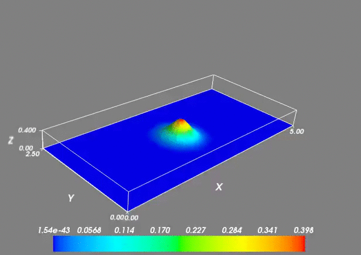

The rectangular domain is discretised into triangles using
[MeshPy](https://mathema.tician.de/software/meshpy/). The edge of the triangle
is chosen as 0.1 cm. The resulting mesh looks like 

A sample simulation run for 0.165 sec using with a gaussian perturbation applied at
the center of the tub is shown in the below animation using 
[Mayavi](http://docs.enthought.com/mayavi/mayavi/)

